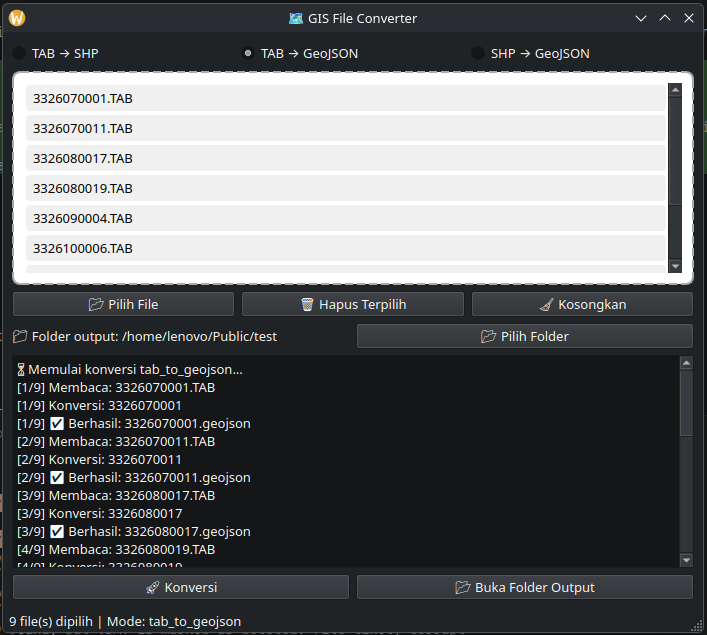

# GIS Converter Desktop

Aplikasi desktop berbasis Python dan PySide6 untuk konversi file GIS:

- TAB → SHP
- TAB → GeoJSON
- SHP → GeoJSON

Aplikasi ini membaca file utama `.tab` atau `.shp` dan, bila tersedia, ikut memanfaatkan file pendukung yang berada di folder yang sama.

## Screenshot

Kalau kamu menaruh file gambar di `assets/screenshot.png`, README ini akan menampilkan tampilan aplikasi di sini:



## Prasyarat

- Linux
- Python 3.12
- `pip`
- `venv`

Jika kamu memakai Ubuntu/Debian, contoh instalasi Python 3.12 dan tool pendukung dasarnya:

```bash
sudo apt update
sudo apt install -y python3.12 python3.12-venv python3-pip
```

Jika paket `python3.12` belum tersedia di distro kamu, kamu bisa memakai `pyenv` atau source resmi Python 3.12.

## Setup Project

1. Masuk ke folder project.

```bash
cd /home/lenovo/Projects/gis-converter-desktop
```

2. Buat virtual environment.

```bash
python3.12 -m venv venv_gis
```

Kalau `python3.12` tidak dikenali, pastikan instalasi Python 3.12 sudah benar. Kamu juga bisa cek dengan:

```bash
python3.12 --version
```

3. Aktifkan virtual environment.

```bash
source venv_gis/bin/activate
```

4. Upgrade `pip` lalu install requirements.

```bash
pip install --upgrade pip
pip install -r requirements.txt
```

## Menjalankan Aplikasi

Setelah dependency selesai terpasang, jalankan:

```bash
python main.py
```

Jendela aplikasi akan terbuka. Dari sana kamu bisa:

- pilih file GIS dengan tombol **Pilih File**
- pilih folder output
- tentukan mode konversi
- klik **Konversi** untuk mulai proses

## Format File yang Didukung

- Input TAB: `.tab` dengan file pendukung seperti `.dat`, `.map`, `.id`, dan `.ind` di folder yang sama
- Input SHP: `.shp` dengan file pendukung seperti `.shx`, `.dbf`, dan `.prj` di folder yang sama

## Catatan Output

- Hasil konversi akan disimpan ke folder output yang kamu pilih.
- Untuk mode GeoJSON, aplikasi akan mencoba mengubah CRS ke `EPSG:4326` jika CRS input berbeda.
- Tombol **Buka Folder Output** memakai `xdg-open`, jadi ini paling nyaman digunakan di Linux desktop.

## Menonaktifkan Virtual Environment

Kalau sudah selesai, keluar dari environment dengan:

```bash
deactivate
```

## Troubleshooting

- Jika muncul error modul tidak ditemukan, pastikan virtual environment sudah aktif sebelum menjalankan `pip install` dan `python main.py`.
- Jika instalasi `geopandas`, `fiona`, atau `pyproj` gagal di Linux, coba pastikan paket dasar build tools dan library GIS dari distro kamu tersedia, lalu ulangi instalasi requirements.
